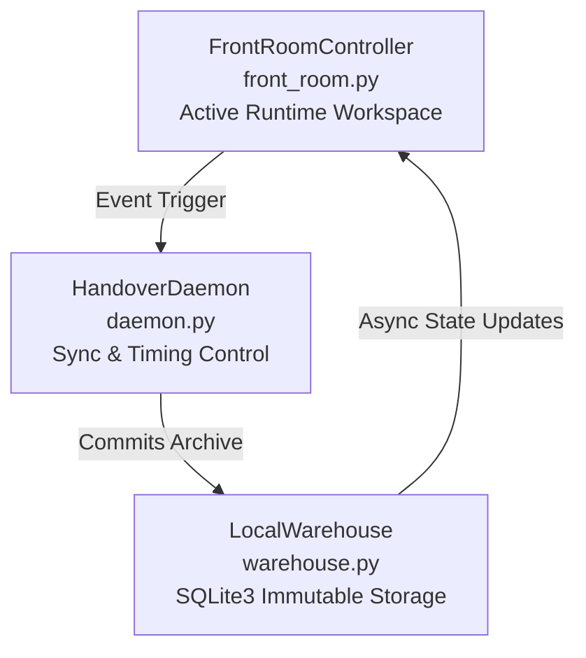

# Decoupled Event-Driven Memory Framework

An event-driven, decoupled memory framework designed to enforce a permanently flat LLM context window footprint and eliminate token accumulation bloat.

---

## 👁️ Architecture Overview

This production blueprint maintains an immutable, flat LLM context window indefinitely by separating the runtime conversation from long-term memory retrieval. The architecture is cleanly decoupled into three specialized micro-components:

1. FrontRoomController (front_room.py)
* Role: Manages the active runtimeworkspace.
* Mechanism: Maintains a highly restricted,lightweight conversation table. Itguarantees that the live model promptnever chokes on historical data turn-count.
2. HandoverDaemon (daemon.py)
* Role: Orchestrates state sync andexecution timing.
* Mechanism: Monitors thread activity,enforces strict context boundaries, andautomatically flushes older conversationalturns out of the runtime environment.
3. LocalWarehouse (warehouse.py)
* Role: Universal, immutable local storagelayer.
* Mechanism: Built on a fast SQLite3 enginewith anchor-based indexing, allowing forlow-overhead, rapid querying of historicalconversational bundles without taxingruntime memory.

🚀 Quick Start
Requirements:
* Python 3.8+
* SQLite3 (included in Python standardlibrary — no install needed)
Run the framework:
bash

# Clone the repository
git clone https://github.com/Omnisolutions-1/Decoupled-llm-memory-framework-.git

# Navigate into the project
cd Decoupled-llm-memory-framework-

# Run the front room controller
python front\_room.py
No external dependencies required for v1.0. Everything runs on Python stdlib.

📊 Performance Metrics & Key Results
During standard stress testing, the architecture demonstrated the following operational metrics:
* Flat Context Footprint: Active contextstays flat at 2–4 messages permanently,completely independent of the totalconversation turn count.
* Compute Optimization: Baseline computeoverhead sits consistently low at ~2–5%load.
* Zero Saturation: Successfully eliminateslong-thread token bloat, promptdegradation, and system latency spikes.

🗺️ Roadmap
*  v1.0 — SQLite3 prototype with event-driven sync and anchor-based indexing
*  v1.0 — Keyword harmonization fix:unified anchor vocabulary across all threecomponents
*  v2.0 — Semantic Ingestion Gateway:vector embeddings replace keyword filters
*  v2.0 — Connection Shield: fault-tolerantcircuit breaker with state persistence
*  v2.0 — FrontRoomController rewrite:cosine similarity drift detection, O(1)context guarantee
*  v2.0 — Modular warehouse adapters:Qdrant, Pinecone, SQLite
*  v2.0 — Multi-provider LLM abstraction:Claude, GPT, Gemini
*  v2.3 — Semantic drift detection withembedding similarity gating
*  v3.0 — Decentralized multi-tenantsession state vaulting

🛠️ How It Was Built: AI Orchestration Workflow
This framework is a direct product of high-velocity AI collaboration. The architectural bottleneck was identified and designed by a non-coder acting as an Architectural Orchestrator, guiding and synchronizing parallel instances of Google Gemini and Anthropic Claude.
The human partner directed high-level pattern recognition, systemic guardrails, and structural mechanics, while the AI models handled localized code generation, stress-test execution, and syntax validation. This methodology proves the commercial viability of multi-model orchestration.
Architectural Orchestrator: Jaclyn (Jax) Status: Open to conversations regarding AI memory systems, multi-model workflow design, or technical operations roles. Contact via GitHub or X.

📋 Changelog
v1.0.1 — Harmonization Fix
* Completed truncated query_warehouseloop in warehouse.py — results nowcorrectly returned from SQLite
* Unified anchor keyword vocabulary:"blueprint" → "architecture" indaemon.py to match front_room.pydetection logic
* All three components now use identicalanchor vocabulary, ensuring consistentbundle indexing
v1.0 — Initial Release
* Three-component decoupled architecture:FrontRoomController, HandoverDaemon,LocalWarehouse
* SQLite3 storage with anchor-basedindexing
* Event-driven context boundaryenforcement
* Flat active context window: 2–4 messagesregardless of turn count
