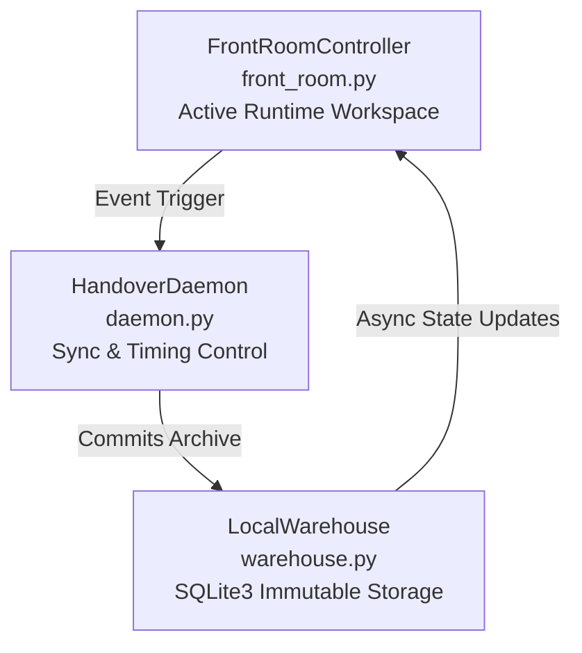

# Decoupled Event-Driven Memory Framework (PoC)

An event-driven, decoupled memory framework designed to enforce a permanently flat LLM context window footprint and eliminate token accumulation bloat.

---

## 👁️ Architecture Overview

This production blueprint maintains an immutable, flat LLM context window indefinitely by separating the runtime conversation from long-term memory retrieval. The architecture is cleanly decoupled into three specialized micro-components:

### 1. FrontRoomController (`front_room.py`)
* **Role:** Manages the active runtime workspace.
* **Mechanism:** Maintains a highly restricted, lightweight conversation table. It guarantees that the live model prompt never chokes on historical data turn-count.

### 2. HandoverDaemon (`daemon.py`)
* **Role:** Orchestrates state sync and execution timing.
* **Mechanism:** Monitors thread activity, enforces strict context boundaries, and automatically flushes older conversational turns out of the runtime environment.

### 3. LocalWarehouse (`warehouse.py`)
* **Role:** Universal, immutable local storage layer.
* **Mechanism:** Built on a fast SQLite3 engine with anchor-based indexing, allowing for low-overhead, rapid querying of historical conversational bundles without taxing runtime memory.

---

## 📊 Performance Metrics & Key Results

During standard stress testing, the architecture demonstrated the following operational metrics:
* **Flat Context Footprint:** Active context stays flat at **2–4 messages permanently**, completely independent of the total conversation turn count.
* **Compute Optimization:** Baseline compute overhead sits consistently low at **~2–5% load**.
* **Zero Saturation:** Successfully eliminates long-thread token bloat, prompt degradation, and system latency spikes.

---

## 🗺️ Production Scaling Roadmap

### Phase 1.0 — Current Operational Blueprint
* Deterministic SQLite3 prototype with event-driven synchronization loops.
* Rigid rule-based boundary management for local context truncation.

### Phase 2.0 — Semantic Ingestion Gateway (Vector Upgrade)
* **Semantic Processing:** Replace prototype keyword filters with Vector Embeddings for mathematical intent recognition.
* **Telemetry Timing:** Calibrate the Daemon sensor to trigger on semantic shifts or natural conversational pauses rather than rigid per-turn loops.
* **Cloud Infrastructure:** Migrate local storage files to an enterprise cloud vector database (e.g., Pinecone, pgvector, or Qdrant).

### Phase 3.0 — Intent-Aware Gating & Global Scaling
* Implementation of drift detection utilizing vector embedding similarity gating.
* Decentralized cloud infrastructure featuring distributed multi-tenant session state vaulting.

---

## 🛠️ How It Was Built: AI Orchestration Workflow

This framework is a direct product of high-velocity AI collaboration. The architectural bottleneck was identified and designed by a non-coder acting as an **Architectural Orchestrator**, guiding and synchronizing parallel instances of **Google Gemini** and **Anthropic Claude**. 

The human partner directed high-level pattern recognition, systemic guardrails, and structural mechanics, while the AI models handled localized code generation, stress-test execution, and syntax validation. This methodology proves the commercial viability of multi-model orchestration.

**Architectural Orchestrator:** Jaclyn (Jax)  
**Status:** Open to conversations regarding AI memory systems, multi-model workflow design, or technical operations roles. Contact via GitHub or X.
